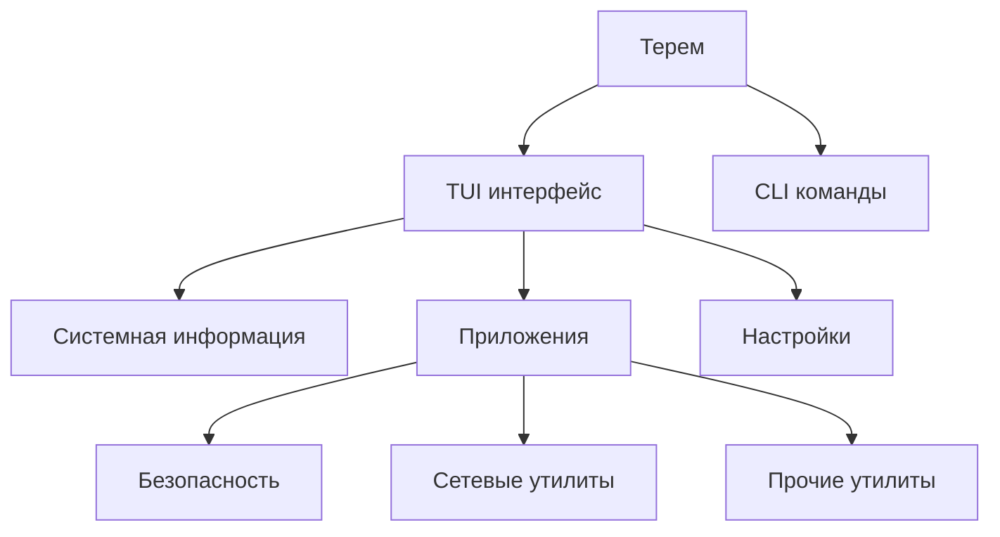

# Терем

**Терем** - это современная TUI-утилита, разработанная на языке Go для упрощения управления и настройки роутеров с операционной системой Entware/OpenWrt.

<Info>
  Терем предоставляет интуитивно понятный текстовый интерфейс для управления различными аспектами вашего роутера прямо из терминала.
</Info>

## Что такое Терем?

Терем - это комплексное решение для системных администраторов и продвинутых пользователей, которое объединяет в себе:

- **Мониторинг системы** - отслеживание состояния роутера в реальном времени
- **Управление безопасностью** - настройка фаерволов, VPN и других средств защиты
- **Сетевые утилиты** - диагностика и оптимизация сетевых подключений
- **Автоматизация** - выполнение рутинных задач через удобный интерфейс

## Основные возможности

<CardGroup cols={2}>
  <Card title="TUI интерфейс" icon="computer">
    Полнофункциональный текстовый интерфейс пользователя с поддержкой клавиатурной навигации
  </Card>
  <Card title="Мультиязычность" icon="globe">
    Поддержка русского, английского, белорусского и казахского языков
  </Card>
  <Card title="Модульная архитектура" icon="puzzle">
    Расширяемая система плагинов для добавления новой функциональности
  </Card>
  <Card title="Автоматизация" icon="robot">
    Поддержка скриптов и синонимов для быстрого выполнения команд
  </Card>
</CardGroup>

## Для кого предназначен Терем?

### Системные администраторы
Упрощение управления парком роутеров и автоматизация рутинных задач

### Продвинутые пользователи
Получение полного контроля над своим сетевым оборудованием

### Разработчики
Создание собственных модулей и расширений для платформы

## Архитектура приложения

## Начало работы

Для начала работы с Терем:

1. [Проверьте требования](/ru/about/requirements) к системе
2. [Установите](/ru/installation/install) приложение
3. [Выполните первоначальную настройку](/ru/installation/initial-setup)
4. [Запустите](/ru/installation/launch) Терем

<Note>
  Терем активно развивается. Следите за обновлениями в нашем [GitHub репозитории](https://github.com/qzeleza/terem).
</Note>